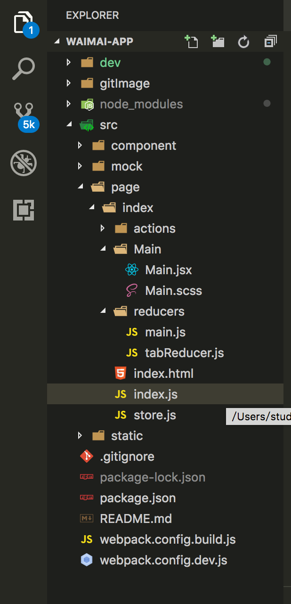

### 从零开始搭建项目过程

#### 第一步：
1. 新建目录文件夹
2. cd 目录文件夹，执行npm init
3. 项目内安装webpack以及webpack-cli,执行npm install webpack以及webapck-cli --save
4. 根目录下新建webpack.config.dev.js和webpack.config.build.js
5. 根目录下新建dev文件夹和src文件夹作为打包后的目标文件和源码的文件夹
6. src文件夹下新建component文件夹，page文件夹，static文件夹，这个根据个人项目需求而定，我这里component作为组件目录，page作为页面目录，static作为静态资源目录，page目录下每个页面新建一个文件夹，里面页面的入口文件index.js,以及页面index.html，页面的真正组件放在Main文件夹下，目录结构如下所示


#### 第二步： 配置webpack
1. 打开webpack.config.dev.js
2. 配置多页面入口entry
```
const srcRoot = path.resolve(__dirname, 'src');
const devPath = path.resolve(__dirname, 'dev');
const pageDir = path.resolve(srcRoot, 'page');
const mainFile = 'index.js';
function getEntry() {
  let entryMap = {};
  fs.readdirSync(pageDir).forEach((pathname) => {
    let fullPathName = path.resolve(pageDir, pathname);
    let stat = fs.statSync(fullPathName);
    let fileName = path.resolve(fullPathName, mainFile);
    if (stat.isDirectory() && fs.existsSync(fileName)) {
      entryMap[pathname] = fileName;
    }
  });
  return entryMap;
}
const entryMap = getEntry();
module.exports = {
  entry: entryMap
}
```
3. 配置打包的目录文件output
```
module.exports = {
  entry: entryMap,
  output: {
    path: devPath,
    filename: '[name].min.js'
  }
}
```
4. 配置匹配规则module
```
module: {
  rules: [
    {test: /\.(js|jsx)$/, use: ['babel-loader'], include: pageDir},
    {test: /\.css$/, use: ['style-loader', 'css-loader'], include: pageDir},
    {test: /\.scss$/, use: ['style-loader', 'css-loader', 'sass-loader'], include: pageDir},
    {test: /\.(png|jpg|jpeg)$/, use: 'url-loader?limit=8192', include: pageDir}
  ]
}
```
5. 配置多页面模板插件html-webpack-plugin
```
const HtmlWebpackPlugin = require('html-webpack-plugin');
function getHtmlArray(entryMap) {
  let htmlArray = [];
  Object.keys(entryMap).forEach((key) => {
    let fullPathName = path.resolve(pageDir, key);
    let fileName = path.resolve(fullPathName, key + '.html');
    if(fs.existsSync(fileName)) {
      htmlArray.push(new HtmlWebpackPlugin({
        filename: key + '.html',
        template: fileName,
        chunks: [key]
      }));
    }
  });
  return htmlArray;
}
const htmlArray = getHtmlArray(entryMap);
plugins: [
].concat(htmlArray)
```
##### 完整代码如下：
```
const path = require('path');
const fs = require('fs');
const HtmlWebpackPlugin = require('html-webpack-plugin');
const srcRoot = path.resolve(__dirname, 'src');
const devPath = path.resolve(__dirname, 'dev');
const pageDir = path.resolve(srcRoot, 'page');
const mainFile = 'index.js';
function getHtmlArray(entryMap) {
  let htmlArray = [];
  Object.keys(entryMap).forEach((key) => {
    let fullPathName = path.resolve(pageDir, key);
    let fileName = path.resolve(fullPathName, key + '.html');
    if(fs.existsSync(fileName)) {
      htmlArray.push(new HtmlWebpackPlugin({
        filename: key + '.html',
        template: fileName,
        chunks: [key]
      }));
    }
  });
  return htmlArray;
}
function getEntry() {
  let entryMap = {};
  fs.readdirSync(pageDir).forEach((pathname) => {
    let fullPathName = path.resolve(pageDir, pathname);
    let stat = fs.statSync(fullPathName);
    let fileName = path.resolve(fullPathName, mainFile);
    if (stat.isDirectory() && fs.existsSync(fileName)) {
      entryMap[pathname] = fileName;
    }
  });
  return entryMap;
}
const entryMap = getEntry();
const htmlArray = getHtmlArray(entryMap);
module.exports = {
  mode: 'development',
  entry: entryMap,
  output: {
    path: devPath,
    filename: '[name].min.js'
  },
  module: {
    rules: [
      {test: /\.(js|jsx)$/, use: ['babel-loader'], include: pageDir},
      {test: /\.css$/, use: ['style-loader', 'css-loader'], include: pageDir},
      {test: /\.scss$/, use: ['style-loader', 'css-loader', 'sass-loader'], include: pageDir},
      {test: /\.(png|jpg|jpeg)$/, use: 'url-loader?limit=8192', include: pageDir}
    ]
  },
  plugins: [
  ].concat(htmlArray)
}
```
##### 其中关于babel的配置如下：
- 安装babel相关的包
```
"babel-core": "^6.26.0",
"babel-eslint": "^8.2.3",
"babel-loader": "^7.1.4",
"babel-plugin-react-hot-loader": "^3.0.0-beat.6",
"babel-preset-es2015": "^6.24.1",
"babel-preset-stage-0": "^6.24.1",
"babel-preset-react": "^6.24.1",
```
- 根目录下新建.babelrc文件
```
{
  "presets": [
    "es2015",
    "react",
    "stage-0"
  ]
}
```

